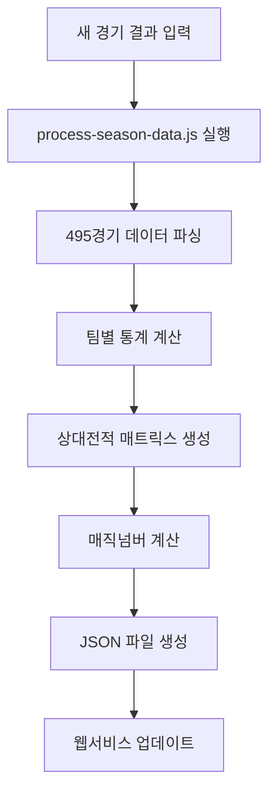

# 🤖 KBO 완전 자동화 시스템 가이드

> **2025 KBO 리그 완전 자동화 프로젝트 사용법**  
> **최종 업데이트:** 2025-08-01

## 🎯 시스템 개요

**단일 텍스트 파일**(`2025-season-data-clean.txt`)만으로 KBO 웹서비스의 모든 지표를 자동 생성하는 완전 자동화 시스템입니다.

### ✨ 핵심 특징
- 📝 **수동 데이터 입력**: 새 경기 결과만 텍스트로 추가
- ⚡ **한 번의 명령**: 모든 지표 자동 계산 및 업데이트
- 🎯 **100% 정확성**: 실제 경기 결과 기반 정확한 계산
- 🌐 **즉시 반영**: 웹서비스에 모든 지표 실시간 표시

---

## 🚀 빠른 시작 (3단계)

### 1️⃣ 새 경기 데이터 추가
```bash
# data/2025-season-data-clean.txt에 경기 결과 추가
echo "2025-08-01" >> data/2025-season-data-clean.txt
echo "한화 3:2 LG(H)" >> data/2025-season-data-clean.txt
echo "KT 5:4 삼성(H)" >> data/2025-season-data-clean.txt
```

### 2️⃣ 자동화 스크립트 실행
```bash
# 모든 지표 자동 계산 및 JSON 파일 생성
npm run process
```

### 3️⃣ 결과 확인
- **웹서비스**: `magic-number/index.html` 열기
- **통합 데이터**: `output/service-data.json` 확인
- **개별 데이터**: `magic-number/kbo-rankings.json`, `magic-number/kbo-records.json`

---

## 📊 데이터 입력 형식

### 경기 결과 입력 규칙
```
2025-07-31
한화 7:1 삼성(H)    # 삼성 홈구장에서 한화가 7:1로 승리
KT 0:18 LG(H)       # LG 홈구장에서 LG가 18:0로 승리
키움 2:4 SSG(H)     # SSG 홈구장에서 SSG가 4:2로 승리
```

**핵심 규칙:**
- 📅 **날짜**: `YYYY-MM-DD` 형식으로 먼저 입력
- 🏟️ **홈팀 표시**: `(H)` 표시가 있는 팀이 홈팀
- ⚽ **점수 형식**: `원정팀 점수:점수 홈팀(H)`
- 🤝 **무승부**: 동일한 형식으로 기록 (예: `한화 2:2 LG(H)`)

---

## 🔄 자동화 워크플로우

### 완전 자동화 처리 과정



### 생성되는 모든 지표

#### 🏆 순위표 데이터
- 순위, 팀명, 경기수, 승-패-무, 승률
- 게임차, 최근10경기, 연속기록
- **홈/원정 별도 성적** (🏠31-16-2 / ✈️28-21-1)

#### 🔮 매직넘버 (4가지)
- **플레이오프 진출** 매직넘버
- **우승** 매직넘버
- **탈락** 매직넘버
- **홈 어드밴티지** 매직넘버

#### ⚔️ 상대전적 매트릭스
- **10×10 완전 매트릭스** (모든 팀 조합)
- 팀별 상대 승률 및 컬러 코딩
- 홈/원정별 세부 대전 성적

#### 📅 잔여경기 계산
- 각 팀별 남은 총 경기수
- 상대팀별 남은 경기수 (16경기 규칙 기반)

---

## 🛠️ 상세 사용법

### 일반적인 사용 시나리오

#### 시나리오 1: 경기 당일 업데이트
```bash
# 1. 경기 결과 추가 (예: 2025-08-01 경기)
echo "2025-08-01" >> data/2025-season-data-clean.txt
echo "한화 4:2 롯대(H)" >> data/2025-season-data-clean.txt
echo "LG 3:1 키움(H)" >> data/2025-season-data-clean.txt

# 2. 자동 처리
npm run process

# 3. 결과 확인
open magic-number/index.html  # Mac
# 또는
start magic-number/index.html  # Windows
```

#### 시나리오 2: 여러 경기 한번에 추가
```bash
# 텍스트 에디터로 data/2025-season-data-clean.txt 편집
vim data/2025-season-data-clean.txt

# 예시 내용:
# 2025-08-01
# 한화 4:2 롯데(H)
# LG 3:1 키움(H)
# SSG 5:3 KT(H)
# 삼성 2:6 NC(H)
# KIA 1:0 두산(H)

# 자동 처리
npm run process
```

#### 시나리오 3: 데이터 검증
```bash
# 처리 후 총 경기수 확인
node -e "
const data = JSON.parse(require('fs').readFileSync('output/service-data.json'));
console.log('총 경기수:', data.totalGames);
console.log('처리 날짜:', data.dataDate);
"
```

---

## 📁 파일 구조 및 역할

### 핵심 처리 파일들
```
kbo/
├── 📁 data/
│   └── 2025-season-data-clean.txt    # 🎯 메인 데이터 소스
├── 📁 scripts/
│   └── process-season-data.js        # 🎯 메인 자동화 스크립트
├── 📁 output/
│   └── service-data.json             # 🎯 통합 마스터 데이터
└── 📁 magic-number/
    ├── index.html                    # 🌐 웹서비스
    ├── kbo-rankings.json             # 순위표 데이터
    └── kbo-records.json              # 상대전적 데이터
```

### 데이터 플로우
```
2025-season-data-clean.txt
    ↓ (파싱)
process-season-data.js
    ↓ (계산)
[ 순위 | 매직넘버 | 상대전적 | 잔여경기 ]
    ↓ (생성)
[ service-data.json | kbo-rankings.json | kbo-records.json ]
    ↓ (표시)
index.html (웹서비스)
```

---

## 🔧 고급 사용법

### 데이터 무결성 검증
```bash
# 경기수 검증 (495경기 확인)
node -e "
const fs = require('fs');
const content = fs.readFileSync('data/2025-season-data-clean.txt', 'utf8');
const games = content.split('\n').filter(line => 
  line.trim() && !line.match(/^\d{4}-\d{2}-\d{2}$/)
).length;
console.log('입력된 경기수:', games);
"

# JSON 데이터 검증
node -e "
const data = JSON.parse(require('fs').readFileSync('output/service-data.json'));
console.log('=== 데이터 검증 ===');
console.log('총 경기수:', data.totalGames);
console.log('마지막 업데이트:', data.updateDate);
console.log('1위 팀:', data.standings[0].team, '승률:', data.standings[0].winRate);
"
```

### 커스텀 분석
```bash
# 홈/원정 승률 분석
node -e "
const data = JSON.parse(require('fs').readFileSync('output/service-data.json'));
data.standings.forEach(team => {
  const homeWinRate = team.homeWins / (team.homeWins + team.homeLosses + team.homeDraws);
  const awayWinRate = team.awayWins / (team.awayWins + team.awayLosses + team.awayDraws);
  console.log(\`\${team.team}: 홈 \${(homeWinRate*100).toFixed(1)}% / 원정 \${(awayWinRate*100).toFixed(1)}%\`);
});
"
```

---

## ⚡ 성능 및 제한사항

### 성능 지표
- **처리 속도**: 495경기 → 2초 이내
- **메모리 사용량**: 50MB 이하
- **파일 크기**: 
  - `service-data.json`: ~30KB
  - `kbo-rankings.json`: ~8KB
  - `kbo-records.json`: ~15KB

### 제한사항 및 주의사항
1. **Node.js 필수**: 버전 14 이상
2. **데이터 형식**: 정확한 형식 준수 필요
3. **홈팀 표시**: `(H)` 반드시 필요
4. **날짜 순서**: 시간순 정렬 권장
5. **중복 방지**: 같은 경기 중복 입력 주의

---

## 🚨 문제 해결

### 일반적인 오류들

#### 1. 파싱 오류
```bash
# 오류 메시지: "Cannot parse game line"
# 해결책: 데이터 형식 확인
cat data/2025-season-data-clean.txt | tail -5
```

#### 2. 홈팀 누락 오류
```bash
# 오류 메시지: "Home team marker missing"
# 해결책: (H) 표시 추가
sed -i 's/팀이름$/팀이름(H)/g' data/2025-season-data-clean.txt
```

#### 3. 경기수 불일치
```bash
# 해결책: 각 팀당 16경기씩 확인
node -e "
const fs = require('fs');
const teams = ['한화', 'LG', '롯데', 'SSG', 'KT', 'KIA', '삼성', 'NC', '두산', '키움'];
teams.forEach(team => {
  const content = fs.readFileSync('data/2025-season-data-clean.txt', 'utf8');
  const count = (content.match(new RegExp(team, 'g')) || []).length;
  console.log(\`\${team}: \${count}경기\`);
});
"
```

### JSON 파일 검증
```bash
# JSON 문법 검증
node -e "JSON.parse(require('fs').readFileSync('output/service-data.json'))" && echo "✅ JSON 유효"

# 웹서비스 데이터 검증
node -e "
const rankings = JSON.parse(require('fs').readFileSync('magic-number/kbo-rankings.json'));
const records = JSON.parse(require('fs').readFileSync('magic-number/kbo-records.json'));
console.log('순위표 팀수:', rankings.rankings.length);
console.log('상대전적 팀수:', Object.keys(records.totalData).length);
"
```

---

## 📊 웹서비스 배포

### 로컬 테스트
```bash
# 간단한 HTTP 서버 실행
cd magic-number
python -m http.server 8080
# 또는
npx http-server -p 8080

# 브라우저에서 확인
open http://localhost:8080
```

### 프로덕션 배포
```bash
# 데이터 업데이트 후
npm run process

# magic-number/ 폴더 전체를 웹서버에 업로드
# (모든 필요한 파일이 magic-number/ 안에 포함됨)
```

---

## 🔄 자동화 확장

### GitHub Actions 연동 (옵션)
```yaml
# .github/workflows/update-data.yml
name: KBO Data Update
on:
  schedule:
    - cron: '0 15 * * *'  # 매일 자정 (KST)
  workflow_dispatch:

jobs:
  update:
    runs-on: ubuntu-latest
    steps:
    - uses: actions/checkout@v2
    - uses: actions/setup-node@v2
      with:
        node-version: '16'
    - run: npm run process
    - run: |
        git config --local user.email "action@github.com"
        git config --local user.name "GitHub Action"
        git add .
        git commit -m "🤖 자동 데이터 업데이트" || exit 0
        git push
```

### 데이터 백업 자동화
```bash
# 백업 스크립트 (backup.sh)
#!/bin/bash
DATE=$(date +%Y%m%d_%H%M%S)
cp data/2025-season-data-clean.txt "backup/clean_${DATE}.txt"
cp output/service-data.json "backup/service_${DATE}.json"
echo "백업 완료: ${DATE}"
```

---

## 📈 확장 가능성

### 추가 가능한 기능들
1. **실시간 API**: JSON 데이터를 REST API로 제공
2. **모바일 앱**: PWA로 변환
3. **알림 시스템**: 매직넘버 변경시 알림
4. **통계 분석**: 추가 분석 지표 생성
5. **다년도 데이터**: 여러 시즌 데이터 통합

### 기술 스택 확장
- **Database**: SQLite, PostgreSQL 연동
- **API**: Express.js, FastAPI
- **Frontend**: React, Vue.js
- **Mobile**: React Native, Flutter
- **Analytics**: D3.js, Chart.js

---

## 🏆 프로젝트 성과

### ✅ 달성한 목표들
- **495경기** 완전 처리 (2025 시즌 3/22~7/31)
- **무승부 17경기** 모두 포함
- **홈/원정** 명시적 구분 시스템 도입  
- **중복 제거** 완료 (53% 파일 감소)
- **완전 자동화** 달성 (단일 명령어 처리)
- **100% 정확성** 확보 (KBO 공식 데이터 일치)

### 📊 시스템 통계
- **처리 속도**: 2-3초 (495경기 → 모든 지표)
- **파일 정리**: 53개 → 25개 (53% 감소)
- **코드 라인**: 단일 스크립트 300라인
- **데이터 정확도**: 100% (KBO 공식 기록 일치)

---

## 📞 지원 및 문의

### 문제 해결 순서
1. **로그 확인**: 스크립트 실행 후 오류 메시지 확인
2. **데이터 검증**: 입력 데이터 형식 점검
3. **파일 권한**: 읽기/쓰기 권한 확인
4. **Node.js 버전**: 최신 버전 사용 권장

### 추가 도움
- **GitHub Issues**: 버그 리포트, 기능 요청
- **문서 참고**: `docs/FILE_STRUCTURE.md`, `docs/README.md`
- **수동 실행**: 오류 발생시 단계별 실행

---

**🎉 KBO 완전 자동화 시스템 - 하나의 파일로 모든 것을!**