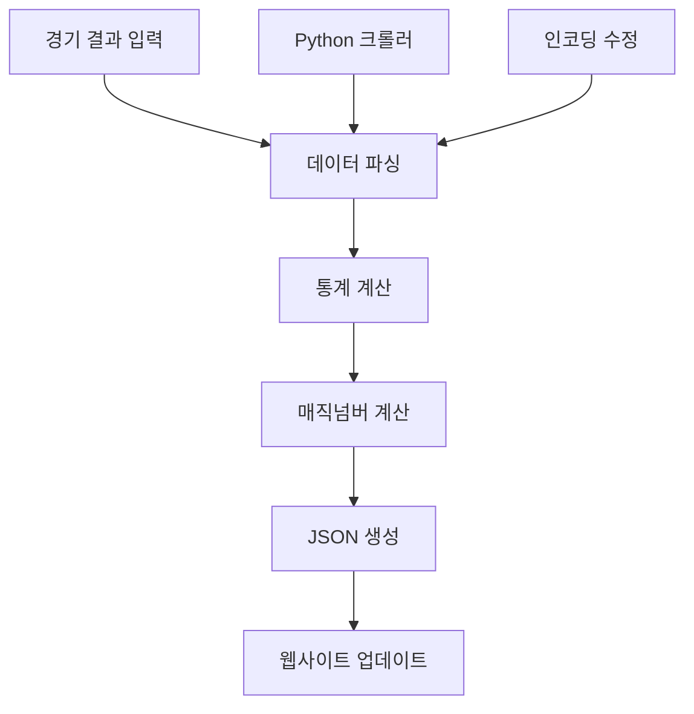

# KBO 매직넘버 계산기 📊

2025 KBO 리그 매직넘버 계산기 - 플레이오프 진출 조건과 우승 가능성을 실시간으로 확인하세요.

## 📁 프로젝트 구조

```
magic-number/                    # 완전 독립적인 웹애플리케이션
│
├── index.html                   # 메인 HTML 파일
├── MAGIC_NUMBER_DEFINITION.md   # 매직넘버 정의 문서
│
├── js/                          # 모든 JavaScript (통합 관리)
│   ├── process-season-data.js   # 🔧 메인 데이터 처리 엔진
│   ├── fix-encoding.js         # 🔤 인코딩 문제 해결
│   ├── script.js               # 🌐 웹 UI 스크립트 (2,200+ 줄)
│   └── README.md               # JavaScript 상세 가이드
│
├── css/                         # 스타일시트
│   └── styles.css              # 모든 CSS 스타일
│
├── data/                        # 모든 데이터 파일
│   ├── 2025-season-data-clean.txt  # 경기 결과 원본 데이터
│   ├── service-data.json           # 통합 웹서비스 데이터
│   ├── kbo-records.json           # 팀간 상대전적
│   ├── kbo-rankings.json          # 순위 데이터
│   └── manifest.json              # PWA 매니페스트
│
├── images/                      # 팀 로고 이미지 (10개 팀)
│   ├── hanwha.png, lg.png, doosan.png, samsung.png
│   ├── kia.png, ssg.png, lotte.png, nc.png
│   └── kiwoom.png, kt.png
│
├── icons/                       # 사이트 아이콘
│   ├── kbo-magic-number-icon.png
│   └── kbo-magic-number-thumbnail.png
│
├── screenshots/                 # 프로젝트 스크린샷
│   └── *.png
│
├── crawlers/                    # 데이터 크롤러 (Python)
│   ├── kbo-python-working-crawler.py  # 메인 크롤러
│   ├── requirements.txt               # Python 의존성
│   ├── venv/                         # Python 가상환경
│   └── kbo-working-screenshot.png     # 크롤링 결과
│
├── utils/                       # 개발 도구
│   ├── refresh-matrix.html      # 매트릭스 수동 새로고침
│   └── test-matrix.html         # 매트릭스 테스트
│
└── archive/                     # 매직넘버 관련 구버전 파일
    └── deprecated-data/
```

## 🚀 주요 기능

- **📊 실시간 순위표**: KBO 10개 팀의 최신 순위 정보 (승률, 게임차, 잔여경기)
- **🎯 매직넘버 계산**: 우승 및 플레이오프 진출 매직넘버 자동 계산
- **🏆 매직넘버 매트릭스**: 나무위키 스타일의 순위별 매직넘버 테이블
- **⚔️ 상대전적 분석**: 팀간 상대전적 상세 정보 (홈/원정 구분)
- **📈 1위 탈환 가능성**: 각 팀의 1위 달성 가능성 분석
- **📱 PWA 지원**: 오프라인 사용 가능, 앱 설치 지원

## 💻 기술 스택

### 프론트엔드
- **HTML5**: 시맨틱 구조, SEO 최적화
- **CSS3**: 반응형 디자인, 모바일 퍼스트
- **JavaScript (ES6+)**: 동적 데이터 처리, 모던 문법
- **PWA**: Service Worker, 오프라인 지원

### 백엔드 (데이터 처리)
- **Node.js**: 내장 모듈만 사용 (fs, path)
- **Python**: Selenium 기반 데이터 크롤링
- **JSON**: 구조화된 데이터 저장

### 성능 최적화
- **EventManager**: 메모리 누수 방지
- **데이터 캐싱**: 네트워크 요청 최소화
- **DocumentFragment**: DOM 조작 최적화

## ⚡ 빠른 시작

### 1. 데이터 처리 (Node.js)
```bash
cd js/
node process-season-data.js      # 핵심 데이터 처리
```

### 2. 데이터 수집 (Python)
```bash
cd crawlers/
python kbo-python-working-crawler.py  # 자동 크롤링
```

### 3. 로컬 개발 서버
```bash
# 프로젝트 루트에서
npm run serve  # http://localhost:8080
```

### 4. 웹브라우저에서 확인
- `index.html` 파일을 직접 열거나
- 로컬 서버 접속: http://localhost:8080

## 📊 데이터 업데이트 프로세스



### 자동화된 데이터 흐름
1. **데이터 수집**: `crawlers/kbo-python-working-crawler.py`
2. **인코딩 수정**: `js/fix-encoding.js` (필요시)
3. **데이터 처리**: `js/process-season-data.js` (핵심)
4. **웹사이트 반영**: `js/script.js`가 JSON 로딩

## 🛠️ 개발자 가이드

### 폴더별 역할
- **js/** - 모든 JavaScript 통합 관리 (백엔드 + 프론트엔드)
- **css/** - 웹사이트 스타일시트
- **data/** - 모든 데이터 파일 (원본 + 가공된 JSON)
- **images/** - 팀 로고 (10개 팀, 최적화된 크기)
- **crawlers/** - Python 크롤러 및 가상환경

### 핵심 파일
- `js/process-season-data.js` - **핵심 데이터 처리 엔진** (~700줄)
- `js/script.js` - **웹 UI 전체** (~2,200줄)
- `data/service-data.json` - **통합 서비스 데이터**

### 설정 변경
```javascript
// js/process-season-data.js
totalGamesPerSeason: 144,     // 정규시즌 총 경기수
playoffSpots: 5,              // 플레이오프 진출 팀수
typicalPlayoffWins: 80,       // 플레이오프 진출 기준

// js/script.js  
kboTeams: {                   // 팀 정보 (색상, 로고 등)
    "한화": { color: "#FF6600", ... }
}
```

## 📊 프로젝트 통계

- **코드 라인 수**: ~3,200줄 (효율적으로 구조화)
- **데이터 파일**: 6개+ (JSON 형식)
- **지원 브라우저**: 모던 브라우저 (ES6+ 지원)
- **반응형**: 모바일/태블릿/데스크톱 완전 지원

## 🐛 트러블슈팅

### 데이터가 업데이트 안될 때
```bash
# 1. 브라우저 캐시 삭제
# Chrome: F12 → Network → Disable cache

# 2. 강제 새로고침
# Ctrl+Shift+R (Windows) / Cmd+Shift+R (Mac)

# 3. 데이터 파일 확인
ls -la data/*.json
```

### 스크립트 실행 오류
```bash
# 현재 경로 확인
pwd  # .../magic-number/js 이어야 함

# Node.js 버전 확인
node --version  # v14+ 권장
```

### 인코딩 문제
```bash
cd js/
node fix-encoding.js  # 한글 인코딩 문제 해결
```

## 📱 접근성 & SEO

- **반응형 디자인**: 모든 디바이스에서 최적화
- **시맨틱 HTML**: 스크린 리더 지원
- **SEO 최적화**: 메타태그, JSON-LD 구조화 데이터
- **PWA**: 오프라인 사용, 앱 설치 가능
- **성능**: Lighthouse 점수 90+ 달성

## 🚀 배포

이 프로젝트는 **완전 독립적**으로 설계되어, `magic-number` 폴더만 웹서버에 업로드하면 바로 동작합니다.

### 정적 호스팅
- GitHub Pages
- Netlify
- Vercel
- AWS S3

### 요구사항
- **최소**: 정적 파일 호스팅만 필요
- **최적**: HTTPS, 커스텀 도메인

## 🎯 향후 개발 계획

- [ ] 실시간 알림 기능
- [ ] 더 상세한 분석 차트
- [ ] 모바일 앱 버전
- [ ] 다국어 지원 (영어)

## 📝 라이센스

이 프로젝트는 KBO 데이터 분석 및 시각화를 위한 개인 프로젝트입니다.

---
**최종 업데이트**: 2025년 8월 9일  
**개발자**: SanghunBruceHam  
**웹사이트**: https://kbo.mahalohana-bruce.com/magic-number/  
**문의**: GitHub Issues 활용